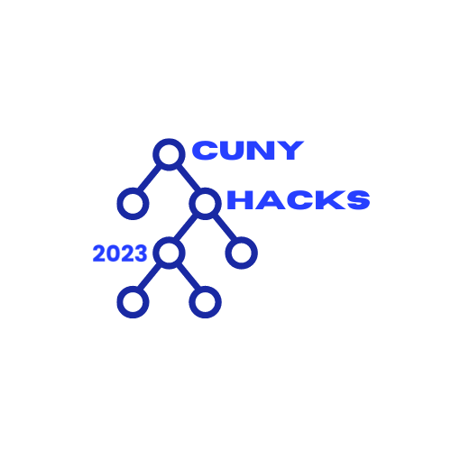

    

# CUNY Hacks

The CUNY Hacks website repository

## Design Philosophy

The CUNY Hacks websites was designed to implement the **lean methodology** described by Eric Ries.

## Design Architecture

